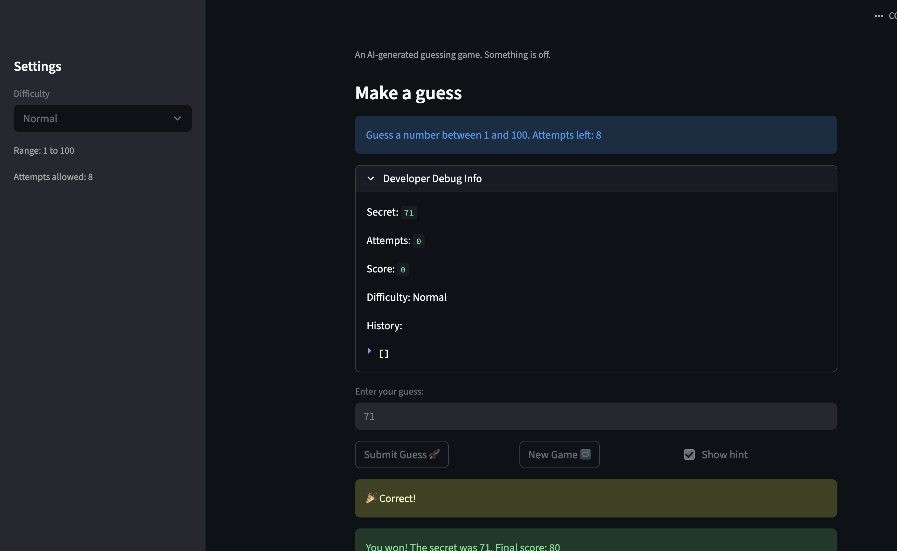
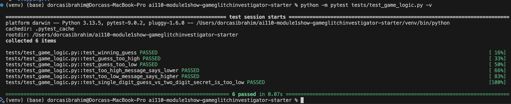

# 🎮 Game Glitch Investigator: The Impossible Guesser

## 🚨 The Situation

You asked an AI to build a simple "Number Guessing Game" using Streamlit.
It wrote the code, ran away, and now the game is unplayable. 

- You can't win.
- The hints lie to you.
- The secret number seems to have commitment issues.

## 🛠️ Setup

1. Install dependencies: `pip install -r requirements.txt`
2. Run the broken app: `python -m streamlit run app.py`

## 🕵️‍♂️ Your Mission

1. **Play the game.** Open the "Developer Debug Info" tab in the app to see the secret number. Try to win.
2. **Find the State Bug.** Why does the secret number change every time you click "Submit"? Ask ChatGPT: *"How do I keep a variable from resetting in Streamlit when I click a button?"*
3. **Fix the Logic.** The hints ("Higher/Lower") are wrong. Fix them.
4. **Refactor & Test.** - Move the logic into `logic_utils.py`.
   - Run `pytest` in your terminal.
   - Keep fixing until all tests pass!

## 📝 Document Your Experience

**Game purpose:**
A number guessing game built with Streamlit where the player picks a difficulty, then tries to guess a secret number within a limited number of attempts. Hints guide the player higher or lower after each guess, and a score is tracked based on how quickly they find the answer.

**Bugs found:**

1. **Backwards hints** — `check_guess` returned "Go HIGHER!" when the guess was too high and "Go LOWER!" when it was too low. The messages were swapped.
2. **Type-mixing on even attempts** — on every second guess, the secret was cast to a string before comparison. Python then compared strings alphabetically (e.g. `"9" > "50"` is `True`), producing wrong hints and preventing a real win.
3. **New Game button didn't reset the game** — clicking New Game after winning or losing had no effect because `st.session_state.status` was never reset to `"playing"`. The app hit `st.stop()` immediately on every rerun. `history` and `score` were also not cleared, and the new secret was hardcoded to range 1–100 regardless of difficulty.

**Fixes applied:**

- Flipped the hint messages in `check_guess` in `logic_utils.py`
- Removed the `if attempts % 2 == 0` string-conversion block in `app.py`; secret is now always passed as an int
- Added `st.session_state.status = "playing"`, `st.session_state.history = []`, `st.session_state.score = 0`, and changed `random.randint(1, 100)` to `random.randint(low, high)` in the New Game handler
- Refactored all four logic functions out of `app.py` into `logic_utils.py`
- Added 3 targeted pytest cases covering each fixed bug; fixed pre-existing tests that compared the full return tuple to a plain string

## 📸 Demo

**pytest results — all 6 tests passing:**

